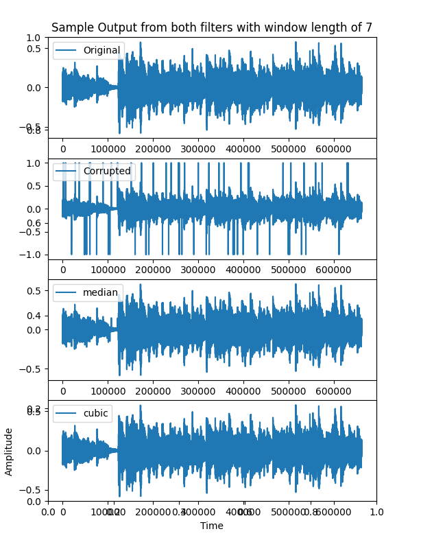
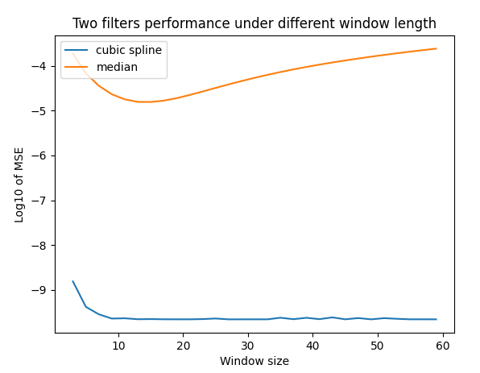
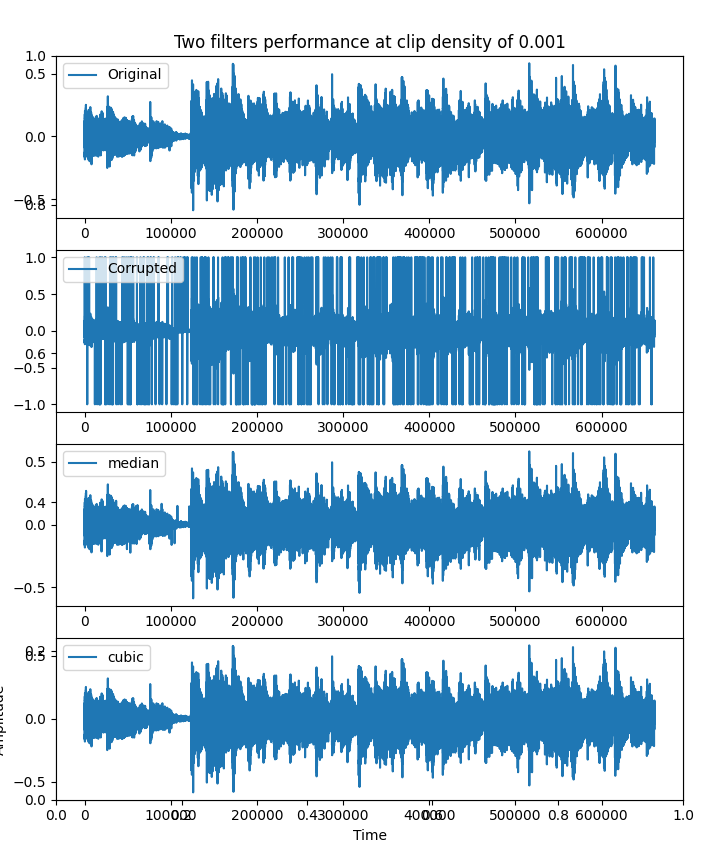

# Add here a title for the project

## Table of Content
1. [High-level Description of the project](#my-first-title)
2. [Installation and Execution](#my-second-title)
3. [Methodology and Results](#my-third-title)
4. [Discussion](#my-fourth-title)
5. [Appendics](#my-fifth-title)
## High-level Description of the project
This assignment builds on Assignment I. 
Which code could be found at: 
We assume that we have successfully detected the clicks and we are applying different interpolation methods to restore the audio, such as
- median filtering
- cubic splines

Using the detected clips index as a prior knowledge, both filters were applied to the deraged signal. This project mainly studied their performance under different window sizes, and also under the noise level of signal, which is quantified as the density of clips existed in the degraded audio.

1) Median Filter:
    Median filter would sort the whole sequence in order of magnitude, obtain the middle element i.e. Median(which requires an odd number of data points), and replace the detected clips by the median. Its logic could be intuitively written as:
    ```
    for data in signal:
        #span is half of (window's length - 1)
        window = signal[sequence(data) - span : 
            sequence(data) + span]
        S_window = sort(window)
        m_value = median(S_window)
        data = m_value
    ```
2) Cubic Spline Filter(CSF):
    In this project, CSF is still at high level application stage, hence detail mathmatical deduction is NOT included. The syntax of Scipy.CubicSpline is explained below:
    Given a discrete sample dataset:
    ```
    Yn = [Y_1, Y_2, .... Y_n]
    ```
    Its corresponded x axis is then a series of incrementing number of the same lenght, for example:
    ```
    X_axis = [0, 1, 2, ..., n]
    ```

    Adapting cubic spline interpolation is then:
    ```
    Y_hat = CubicSpline(X_axis, Yn)
    ```
    Y_hat here would be a countinues signal, fitting all given data points/pairs, i.e. (0, Y_1), (1, Y_2), etc, by a polynomial expression. The powerful side of this method is that, the Y_hat curve always responds given arbitary input on the countiuous axis between 0 to n. i.e.
    ```
    For any x between 0 to n
    There exist a Y_hat(x)
    ```

---

## Installation and Execution
The requiring toolkits for this project is listed blow, or you can directly download the requirement list [here](https://github.com/xiesh527/5C22/blob/main/requirements.txt)
```sh                                 
matplotlib==3.6.2
numpy==1.23.4
openpyxl==3.0.10
pandas==1.5.2
scipy==1.9.3
tqdm==4.64.1
```
Installing these libraries could be done by `pip install from requirement.txt`

For more details about pipreqs check [here](https://github.com/bndr/pipreqs)


Afer installing all required packages you can run the demo file simply by typing:
```sh
python demo_main.py
```
---
For comparison between two filters under higher density of clips(0.001):
```sh
python plot.py
```
## Methodology and Results
Describe here how you have designed your code, e.g. a main script/routine that calls different functions, is the unittesting included in the main routine? 

1) Locating the window
    
    Since assuming the clips' location in the signal is known, with user specified window size, we can loacte the windows around clips easily:
    ```
    window = signal[clip_idx - span : clip_idx + span]
    ```
2) Performing filter algorithm inside the window

    The principle of median filter has been mentioned above, execept for data points at sides where padding is ineed. For instance:

    Suppose the sequence below is going to be processed through a window size of 3 :
    ```
    s = [1, 2, 3, 4, 5]
    ```
    The elements '1' and '5' cannot be filtered since they do not have elements at their left/right, thus
    padding is required:
    ```
    padded_s = [p, 1, 2, 3, 4, 5, p]
    ```
    In this project, p is selected to be the mean of sequence s in order to reduce the influence brought by extreme values.
    
    Whereas for processing CSF, the first step is to tick out clips exsited in the window and the index of those clips. For instance, given a window of signal and coressponded window for detection sequence:
    ```
    window = [1, 2, 999, 4, 5]
    idx_window = [171, 172, 173, 174, 175]
    ```
    Its ticked window and index should be:
    ```
    t_window = [1, 2, 4, 5]
    t_idx_window = [171, 172, 174, 175]
    ```
    Using t_window and t_idx_window for Cubic Spline Interpolation, we can still obtain the polynomial curve from x between 171 to 175, say 
    ```
    window_hat = [1, 2, y_hat, 4, 5]
    ```
    And thus the window could be considered as filtered, where y_hat is the estimated value from the curve at index 173.
3) Restoration

    Substuting these windows back to the corresponding slices from damaged signal should return us the restored signal, this step is applicable for both filter strategies.

4) Summary


    In summary, the restoration of this project could be represented as:
    ```
    1. Take out windows with clips in.
    2. Apply each filter to it respectively.
    3. Return windows back to
    ```
5) Performance Metric

    The performance of filter is measured by MSE, given by:
    ```
    MSE = square(sum(clean_signal - restored_signal))/(length(signal))
    ```
---
**Results**
1. The sample output from both filters is attached below:


From which we can observe both filters did quite good elimination on the damaged signal, yet still some clips are not fully removed.

2. As for the experiment exploring different window sizes' influence on the performance for both filters, 
the following result is observed:



It is noticeable that, Median Filter's MSE initially droped as the window size increasing, whereas it gradually grows as the window gets larger than 15 and finally converges. While CSF's performance quickly drops when windows grows from small length, and this trend is slowed down as window becomes even bigger, its log10 value saturated as -9, which agrees with the result from global CSF(Taking the whole signal as the window).

## Disscussion

From the project, it is obviously that, taking MSE as the metric of performance, CSF witnessed a much better result than Median Filter, the MSE of CSF is significantly lower than its counterpart in scale of 10^(4). Also, the comparison between these two methods is supported by strictly fixed condition: clips(location, density), window sizes, etc,.

One of explaination to this outcome is that, median filter is similar to a linear spline interpolation that only take the start and end of window as input, therefore as window increases, its fitting to the curve would become worse, whereas when window is too small, its fitting is severely influenced by local extremes, i.e., clips.

However, CSF could take in as much input data points to construct its continous polynomial curve, in other words, the window is its training data, therefore, the larger window indicates more abundant training and hence better performance.

To extend this project, we shall intorduce other operating conditions such as Additive White Gaussian Noise(AWGN), whose severity can be measured by Signal to Noise Ratio(SNR).
```
MSE_window_length (window->length(signal)) = MSE_global
```
## Appendics
More sample results


